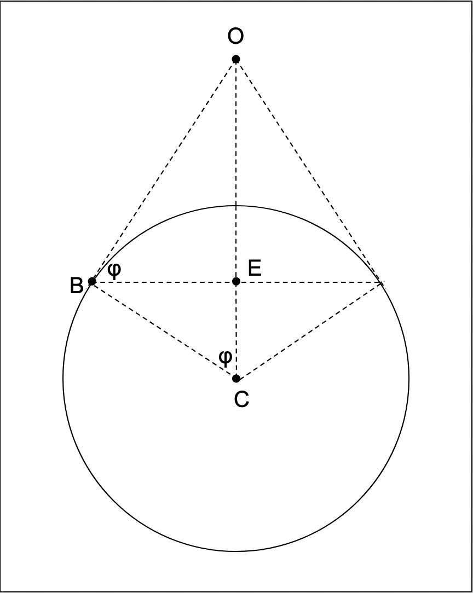

# Spherical Earth Simulator

This app simulates what it would be like to be on or above a sphere of a given size, at a given height, looking out of a window of a given size.

This README explains how the math works.

So, first of all, let's get a formula for the horizon in three-dimensional space. We will take the POV of the observer as the point of origin (0, 0, 0) for our coordinate system, because we can and because it makes the math easier. The observer's direction of gaze will be along the y-axis for the same reason.

Let the height of the observer above the Earth's surface be a (for altitude) and let the radius of the Earth be S. Then (see diagram) the horizon is the circle of radius r with its center at a distance a + d directly below the origin.

Now consider the following diagram:

By construction, the line OB is tangent to the sphere and so the triangle △OBC is a right-angled triangle with |OC| = S + a and |BC| = S. By the Pythgorean theorem, then, |OB| = √(2Sa + a²)

△BEC is a similar right-angled triangle with its hypotenuse |BC| = S.

By the laws of similar triangles we have |BE| / |BC| = |OB| / |OC|.

So |BE| = |BC||OB|/|OC|

Now |BE| is just the radius of the horizon that we're looking for, so we have:

r = |BC||OB| / |OC|

But we already know the distances on the right-hand side (see above), so we can write:

r = S√(2Sa + a²) / (S + a).

Now, what about d? Well, we can again use the laws of similar triangles to say that |EC| / |BC| = |BC| / |OC|

So |EC| = |BC|² / |OC|, and we know the distances on the right—hand side, so we can write |EC| = S² / (S + a).

And then the distance d is just S - |EC|, so we get d = S - (S² / (S + a)).

Great, we've found r and d in terms of S and a.

And so given S and a, if we parameterize our circle by an angle θ in degrees radius anticlockwise from the x-axis, we get the following parametric formulae for the horizon:

* x(θ) = r cos(θ)
* y(θ) = r sin(θ)
* z(θ) = - (a + d)

It would be easy to do a perpective rendition of this but there's a slight snag. We'd like to see what happens when you take off from the sphere and go up. But in order to do that the observer is going to have to direct their gaze further and further down, otherwise they'll lose sight of the horizon.

If we have our observer always center their gaze on the point on the horizon directly ahead of them, and if we continue to choose their direction of gaze as our y-axis, then this is eqivalent to rotating the circle of the horizon through an angle φ (seee diagram above) around the x-axis.

By simple trigonometry, φ = cos⁻¹ (|BC| / |OC|); that is to say, φ = cos⁻¹ (S / (S + a)).

And we know how to rotate things in three-dimensional space by matrix multplication. This gives us another set of parametric equations.

* x₂(θ) = x(θ)
* y₂(θ) = y(θ) cos(φ)- z(θ) sin(φ)
* z₂(θ) = y(θ) sin(φ)+ z(θ) cos(φ)

That, then, is the equation of the horizon if you always look directly at the middle of it. Progress!

Now we just need to draw it in perspective. This is easy, the Renaissance artists knew how to do it. We will put a flat plane a distance F in front of our observer, perpendicular to his direction of gaze, and trace where each line from a point on the horizon to the eye of the observer intersects the plane.

Then the line given by the points λ(x₂, y₂, z₂) for a given θ intersects the plane just when λy₂ = F,  i.e. λ = F / y₂.

So this gives us a set of equations for the points on the perspective plane corresponding to the points on the horizon:

* x₃(θ) = x₂(θ) * F / y₂(θ)
* y₃(θ) = F
* z₃(θ) = z₂(θ) * F / y₂(θ)

Are we there yet? Not quite.

The figure F represents how far the observer is sitting behind their observation window, but doesn't tell us how big it is. Let the window have width W and height H. So when plotting the points of our parametric equation above, we'll only plot the points where -W/2 =< x₃ =< W/2 and  -H/2 =< z₃ =< H/2. (We must also have F <= y₂ or we'd be drawing things *behind* our perspective plane.)

I have made the default window 21 cm wide, since this is apparently the width of a passenger window on a 737.

We also need the resolution P at which we're going to plot things. (I have set the default resolution at 50 pixels / cm because on my own monitor that draws things at approximately life size.)

And we need to correct for the fact that in our coordinate system we're drawing parallel to the x-z plane in a cordinate system centered in front of the observer and with z increasing as we go up, whereas in Object Pascal we draw in the x-y plane where the (0, 0) position is the top left of an image and y increases as we go down. Also pixels are discrete and so we must round to the nearest pixel. So: one last set of parametric equations.

* x₄(θ) = round(W/2 + P * x₃(θ))
* y₄(θ) = round(H/2 - P * z₃(θ))

We're there! All we need to do is iterate through values of θ between 0 and 2π , plot x₄(θ) and y₄(θ) for values that fit into the window, and we will find out what we *should* see, looking out of a window of a given size, from a given height, at a sphere of a given radius, represented at a given resolution.
